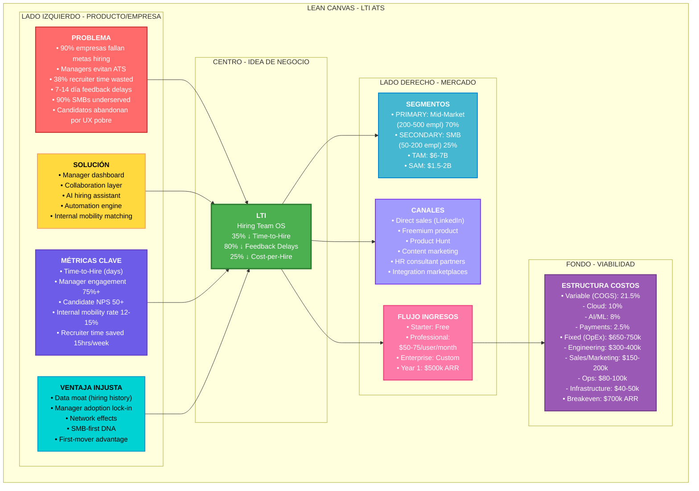
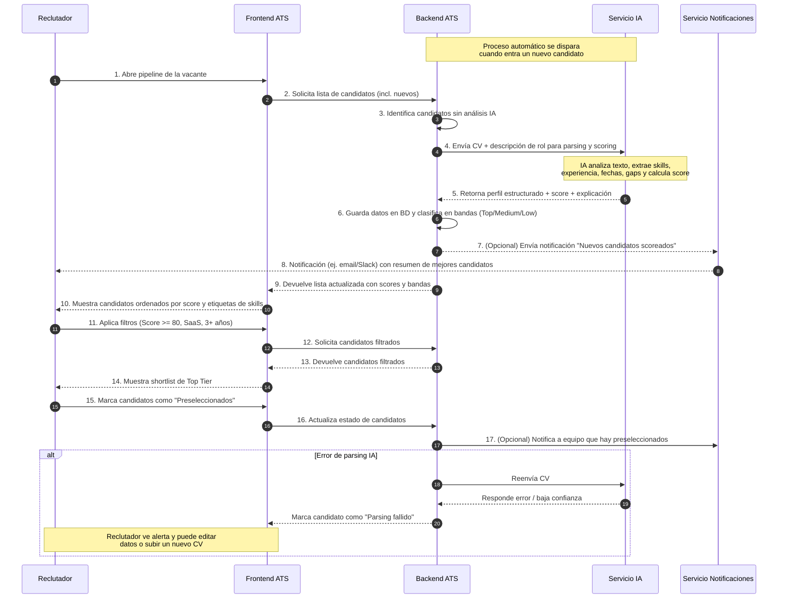
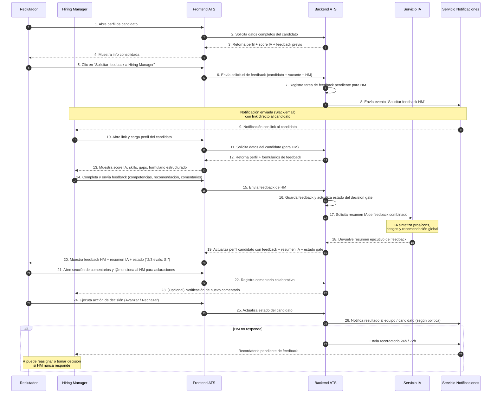
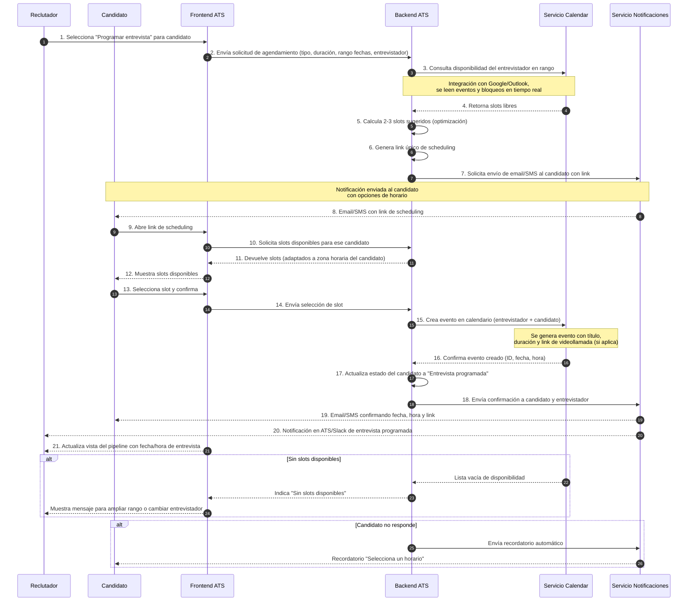
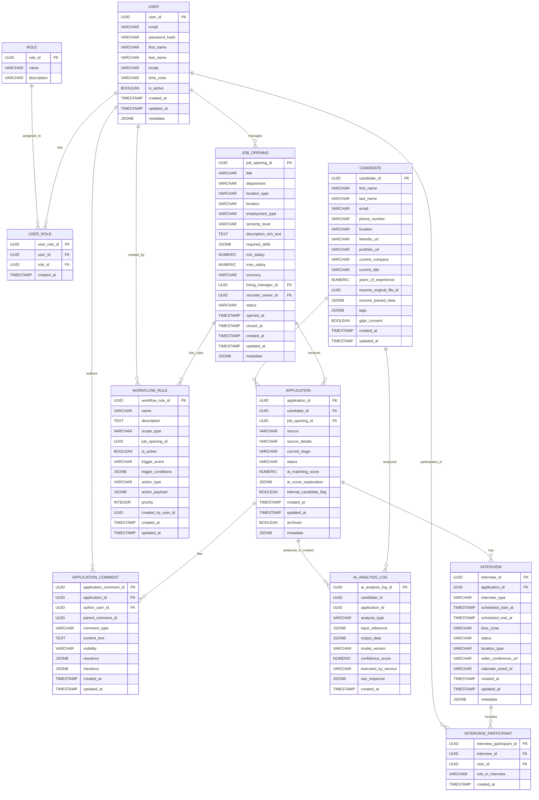
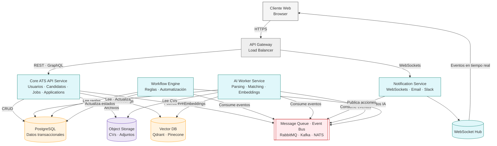
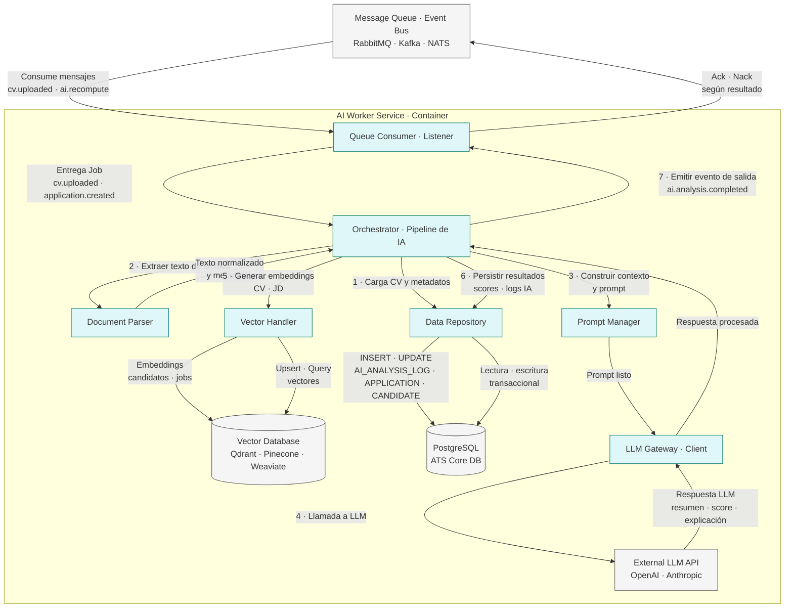

# DOCUMENTACIÓN DE DEFINICIÓN DEL PRODUCTO
## Sistema ATS de Nueva Generación: Collaboration-First, AI-Powered

---

## 1. DESCRIPCIÓN DEL SOFTWARE (ELEVATOR PITCH)

### Versión Ejecutiva

**LTI** es una plataforma de Applicant Tracking System (ATS) de nueva generación diseñada específicamente para resolver la brecha crítica de colaboración entre equipos de HR y hiring managers. A diferencia de soluciones tradicionales (Greenhouse, Lever, Workday) que priorizan la gestión de candidatos, LTI coloca a los **equipos de contratación en el centro**, ofreciendo un espacio de trabajo colaborativo en tiempo real donde recruiter, hiring manager y candidato interactúan de forma sincronizada.

El software combina tres pilares: (1) **Pipeline Intelligence** impulsada por IA (screening automático, matching de candidatos, predicción de retención), (2) **Collaboration Layer** con feedback estructurado asincrónico y alertas en tiempo real, y (3) **Automatización sin fricciones** de tareas repetitivas (scheduling de entrevistas, status updates personalizados, data sync). Está diseñado para equipos de 200-500 empleados que realizan 10-30 contrataciones anuales y buscan reducir Time-to-Hire en 30-40%, mejorar la experiencia del hiring manager, y eliminar 20+ horas de trabajo administrativo por semana.

---

## 2. FUNCIONES PRINCIPALES (CORE FEATURES)

### 2.1 EFICIENCIA HR

#### Pipeline Visual & Job Tracking
- **Descripción:** Dashboard centralizado que muestra estado real de cada posición (requisición, publicación, screening, entrevistas, oferta, inicio) con drilldown granular.
- **Funcionalidad:**
  - Tablero Kanban por etapa de hiring
  - Filtros avanzados: Urgencia, seniority, equipo, skill gaps
  - Predicción automática: "Esta posición tardará X días en cerrarse, skill availability es baja"
  - Histórico: Comparar time-to-hire actual vs promedio de empresa
- **Beneficio:** HR ve bottlenecks en TIEMPO REAL, puede asignar recursos dinámicamente

#### Resume Parsing & Candidate Profile Intelligence
- **Descripción:** Motor NLP advanced que extrae información de resumes con 92%+ accuracy, estructura datos automáticamente.
- **Funcionalidad:**
  - Parsing multi-idioma (soporte LatAm desde MVP)
  - Extracción de skills con nivel de proficiency inferido (Senior, Mid, Junior)
  - Timeline reconstruction: Experiencia laboral parsed, gaps detectados
  - Equivalency matcher: "Java + C++ skills == Good fit for Python role"
  - Red flags automáticas: Frequent job-hopping, unexplained gaps, credentials mismatch
- **Beneficio:** 75% ↓ en tiempo de screening manual, 0% de buenos candidatos perdidos por parsing

#### Search & Boolean Query Builder (Sourcing Assistant)
- **Descripción:** Herramienta de búsqueda inteligente para encontrar candidatos internos + externos (LinkedIn integration planned).
- **Funcionalidad:**
  - Query builder visual para usuarios no-técnicos
  - Saved searches + alerts automáticas cuando candidatos matchean criteria
  - Source tracking: De dónde vinieron (referral, LinkedIn, job board, internal)
  - Talent pool segmentation: "Top performers with mobility", "High-risk attrition"
- **Beneficio:** Internal mobility discovery (oportunidad Blue Ocean)

#### Smart Job Description Generator & Customization
- **Descripción:** IA genera JDs siguiendo best practices y sin sesgos de lenguaje.
- **Funcionalidad:**
  - Template library: Tech, Sales, Ops, Support (pre-trained)
  - Generative AI draft: Input role + level → draft JD in 2 min
  - Bias checker: Scan de lenguaje excesivamente gendered, age-coded, discriminatory
  - Internal vs External version: Auto-generate internal mobility JD
  - Skills mapper: Linked a internal skills taxonomy
- **Beneficio:** 50% ↓ JD creation time, compliance automática

---

### 2.2 COLABORACIÓN EN TIEMPO REAL

#### Hiring Manager Command Center
- **Descripción:** Dashboard personalizado para hiring managers (NON-recruiters) que muestra solo información accionable.
- **Funcionalidad:**
  - Candidate pipeline for MY positions (no noise)
  - Action items: Feedback pending, interviews to conduct, decisions needed
  - Candidate dossier: Summary, interview history, scoring, talking points
  - Progress tracker: "Top 3 candidates, why we like them, next steps"
  - Quick actions: Approve interview, give feedback (2-min form), extend offer
- **Beneficio:** Hiring managers ACTUALLY USE el sistema (vs evitar ATS = email hiring)

#### Integrated Feedback & Decision Workflow
- **Descripción:** Sistema estructurado pero asincrónico para capturar feedback de entrevistas sin fricción.
- **Funcionalidad:**
  - Post-interview feedback form: 2 min max, structured (strengths, gaps, recommendation)
  - Emotion detection (future): Analyze tone in feedback, flag overly subjective comments
  - Feedback aggregation: Todos los evaluadores score, resume consolidated view
  - Decision gates: "Proceeder si 2/3 evaluadores vote sí" (customizable)
  - Bias alerts: "This evaluator rates women 15% lower historically" (coaching)
  - Thread conversations: Managers can comment async without derailing workflow
- **Beneficio:** 60% ↓ feedback collection time, decisiones objectivas, no delays

#### @Mentions & Real-Time Notifications
- **Descripción:** Sistema de alertas contextual que reemplaza email chains por notificaciones in-app.
- **Funcionalidad:**
  - @hiring_manager_name "John, I need your feedback on Maria by EOD"
  - Real-time notifications: Ne alert per action (interview scheduled, feedback given, decision made)
  - Custom alert rules: "Alert me if candidate receives 2 rejections" (stay engaged)
  - Slack/Teams integration: Opcionalmente push key updates a chat platforms
  - Do Not Disturb mode: Managers pueden silence durante reuniones/vacaciones
- **Beneficio:** Feedback loops de 7 días → 1 día, candidatos no caen en limbo

#### Collaborative Interview Notes & Playback
- **Descripción:** Captura inteligente de notes de entrevistas, con transcripción futura (phase 2).
- **Funcionalidad:**
  - Shared note canvas: Interviewer + observer pueden anotar en paralelo
  - Interview rubric guide: Pre-populated competencies a evaluar (customizable)
  - AI-assisted summaries (future): Auto-generate 30-second summary de 60-min interview
  - Sentiment analysis (future): Flag if candidate tone shifted negative mid-interview
  - Recording + transcription (future, with consent): Replay key moments, ensure nothing lost
- **Beneficio:** Notas consistentes, nothing lost in email threads, faster decision-making

---

### 2.3 AUTOMATIZACIÓN

#### Smart Interview Scheduling (Calendar Magic)
- **Descripción:** IA orchestra scheduling de entrevistas sin back-and-forth de emails (acta #2 time sink).
- **Funcionalidad:**
  - Calendar sync: Lee disponibilidad de hiring managers + candidato automáticamente
  - Conflict resolution: Sugiere 3 slots optimal que funcionan para todos
  - Timezone intelligence: Detects y calcula zonas automáticamente (critical LatAm/global)
  - Buffer time: Respecta preferencias (ej. no back-to-back interviews)
  - Reminder system: Automated reminders 24h + 1h antes, con Zoom link
  - Rescheduling: Candidate cancela → system suggests alternatives, intent preservation
  - Analytics: Tracks qué times tienen highest show-up rates
- **Beneficio:** 38% de recruiter time salvado, 99% reduction en scheduling emails

#### Automated Status Updates & Candidate Communication
- **Descripción:** Comunicación personalizada automática sin perder el toque humano.
- **Funcionalidad:**
  - Template library: Pre-written status updates (professional, warm), customizable
  - Triggered automation: Interview scheduled → "Your interview is X with Y, tips inside"
  - Rejection emails: Warm, personal rejection (no "we decided to go another direction")
  - Offer automation: Conditional logic para timing (no premature, no delayed)
  - Two-way SMS: Candidatos pueden responder por SMS para confirmación
  - Feedback sharing (optional): Share interview feedback con candidate (coaching angle)
  - "Apply to similar roles": Si rechazo, system suggests relevant open positions
- **Beneficio:** Candidate experience ↑ 50%, no más "ghosting" por ATS, referral rate ↑ 30%

#### Interview Prep Content Delivery
- **Descripción:** Automated content delivery que prepara candidatos para éxito.
- **Funcionalidad:**
  - Role overview: Auto-populated del JD, key responsibilities
  - Meet the team: Thumbnails + short bios de interviewer(s)
  - Company culture content: Curated videos, values, "day in the life"
  - Interview format guide: "You'll have 3x 30-min technical screens + culture convo"
  - Pre-interview checklist: Tech setup (camera, mic), environment prep
  - Lightweight assessment (optional): Self-timed skill check, not scored, just practice
- **Beneficio:** Candidate confidence ↑, no-show rate ↓, hire quality ↑ (candidates self-select)

#### Requisition & Budget Management
- **Descripción:** Automatiza flujo de requisición linking hiring plan a budget, compliance.
- **Funcionalidad:**
  - Requisition request form: Manager solicita nueva posición, sistema tracks approvals
  - Budget impact: Auto-calculates salary range, benefits cost, approval hierarchy
  - Approved requisition → JD generation triggered, publishing automation initiated
  - Compliance checks: "This team is underrepresented in diversity targets" (flag for strategic hiring)
  - Headcount tracking: Real-time view of authorized vs filled vs in-process
- **Beneficio:** Finance + HR aligned, no rogue hiring, strategic workforce planning possible

---

### 2.4 ASISTENCIA DE IA

#### Candidate Scoring & Compatibility Engine
- **Descripción:** IA machine learning que predice job fit (technical + cultural), mejorando con datos históricos.
- **Funcionalidad:**
  - Initial screen score: Resume parsed against job requirements → 0-100 score
  - Weighted factors: Skills match (40%), experience level (30%), culture indicators (20%), other (10%)
  - Historical calibration: "In OUR company, candidates with X scores succeed 78% of the time"
  - Skill equivalency: "No Python, but Go + Rust = equivalent 85%" (domain-specific logic)
  - Red flags: Overqualified (attrition risk), massive salary expectations, red flags in feedback
  - Bias monitoring: Gender/demographic parity in scores reviewed monthly
- **Beneficio:** Reduce bad hires 30%, no bias-driven score spread, data-driven filtering

#### Interview Question Generator & Guidance
- **Descripción:** IA sugiere relevant interview questions basadas en rol, level, y company data.
- **Funcionalidad:**
  - Question bank: 500+ pre-written questions, organized by competency (leadership, technical, culture)
  - Prompt generation: Input "Senior Full-Stack" → system suggests 8 questions (behavioral + technical)
  - Customization: Manager puede tweakear, add company-specific scenarios
  - Diversity of question types: Avoid always asking same questions (reduces bias)
  - Rubric pre-population: Suggested scoring criteria para cada question
  - Recording: After interview, link question asked → feedback to it
- **Beneficio:** Consistent hiring standards, structured interviews reduce bias, faster prep

#### Skill Gap Analysis & Internal Mobility Matching
- **Descripción:** Análisis de skills que conecta hiring pipeline con talento interno, opportunity Blue Ocean.
- **Funcionalidad:**
  - Skills taxonomy: Internal mapping de all employee skills, proficiency levels, years experience
  - Job requirement matching: "This role needs 3 skills, internal talent has 2/3"
  - Gap analysis: "If we hire Maria internally, she needs 3 weeks upskilling in X"
  - Succession planning: "These 5 internal candidates can fill this role in 6 months"
  - Development path suggestion: "Maria, here's path to Principal Engineer" (retention tool)
  - Internal mobility prioritization: Post role internally FIRST, with visibility to upskilling options
  - Talent marketplace (future): "Browse opportunities matching your skill growth path"
- **Beneficio:** 3x ROI vs external hiring, retention ↑ 25%, cost-per-hire ↓ 60%

#### Predictive Hiring & Early Attrition Warning
- **Descripción:** Modelo predictivo que identifica risk of early departure, enabling proactive retention plans.
- **Funcionalidad:**
  - Historical success cohorts: "Hires similar a TOP PERFORMERS en first 6 months" (predictive)
  - Red flags in profile: "Candidate has rotated jobs every 18 months" (flight risk)
  - Onboarding tracking: First 30 days indicators (engagement, learning speed, culture fit)
  - Early warning: "New hire showing disengagement patterns" → trigger manager checkin
  - Retention plan automation: "High-risk hires get assigned mentor, 1-1s, quarterly check-ins"
  - Comparative analysis: "This hire profile similar to John (stayed 5 years) vs Sarah (left 6 months)"
- **Beneficio:** Reduce new-hire attrition 30-40%, save 6-figure costs per bad exit

#### Generative AI: Job Descriptions, Rejection Emails, Offer Letters
- **Descripción:** AI asistant que drafts key communication, reducing writing burden.
- **Funcionalidad:**
  - JD generation: Input role + level → draft, human review + customize
  - Rejection emails: Different templates para each stage (rejected at initial screen vs final round)
  - Offer letter drafting: Input salary, start date → professional offer letter
  - Feedback synthesis: AI reads all interview feedback → generates executive summary
  - Email tone analyzer: Check draft emails para tone (avoid too cold, overly casual)
- **Beneficio:** 50% ↓ administrative writing, consistency in communications, faster turnaround

#### Compensation Intelligence (Future Phase 2)
- **Descripción:** IA que contextualiza offer expectations, predicts acceptance likelihood.
- **Funcionalidad:**
  - Market data integration: Salary benchmarks por role/level/geography
  - Predictive acceptance: "At $85k, 72% candidates accept; at $75k, 40%" (internal data)
  - Competitor offer intelligence: "Similar candidates getting $90-100k elsewhere" (market signals)
  - Equity modeling: "This total comp package competitive for 90th percentile"
- **Beneficio:** Reduce counter-offer negotiation time, higher acceptance rates, fair compensation

---

## 3. VENTAJAS COMPETITIVAS

### Diferenciador #1: Hiring Manager-Centric Design (Vs Recruiter-Centric)

**Problem Solved:**
- Current ATS platforms (Greenhouse, Lever, Workday) priorizan recruiter experience
- Hiring managers, who ARE el bottleneck de feedback, encuentran ATSs cumbersome
- Resultado: Hiring managers evitan sistema, comunican vía email/Slack, creando silos

**LTI Solution:**
- Manager dashboard diseñado específicamente para acción rápida, no data exploration
- Action-first UI: "Feedback pending" list, "Interviews I need to conduct", "Decisions waiting for me"
- 2-min feedback forms, no essays, pre-structured competencies
- Real-time alerts (no checking dashboard) via Slack/email para decisiones críticas
- Manager education: Coaching en feedback quality, bias detection, decision rigor

**Competitive Impact:**
- 30-50% ↓ feedback loops (7 days → 24-48 hours) vs Greenhouse
- Manager adoption 80%+ vs 40% industry average (per Phenom 2026 report)
- HR can actually forecast time-to-hire accurately (managers engaged)

---

### Diferenciador #2: Collaboration Layer (Real-Time Feedback + Async Alignment)

**Problem Solved:**
- 70% de hiring failures due to HR-Manager misalignment, delayed feedback
- Feedback lives in email threads, gets lost
- No structured way to resolve disagreements (e.g., one manager loves candidate, other rejects)

**LTI Solution:**
- Integrated collaboration canvas por candidato: HR + Managers + Interviewers see same info
- Structured async feedback: Each evaluator inputs independently, consolidated view prevents groupthink
- Decision gates: "Proceeder si 2/3 managers agree" (clear rules, no politics)
- Bias alerts: "Evaluator X rates women 15% lower historically" (transparency enables coaching)
- Comment threads: Managers can discuss async without derailing workflow

**Competitive Impact:**
- First mainstream ATS con collaboration layer (Greenhouse, Lever, Workday = info silos)
- Time-to-decision ↓ 40% vs current manual processes
- Decisiones más justas + documentadas (compliance benefit)

---

### Diferenciador #3: SMB-First Product Design + Affordable Pricing

**Problem Solved:**
- 90% of SMBs underserved (Greenhouse, Lever too complex/expensive)
- Traditional ATS require months to set up, deep IT involvement
- SMBs want simplicity + rapid deployment, not enterprise features

**LTI Solution:**
- Zero-config setup: Deploy in days, not months
- Pre-built workflows: Tech hiring, Sales hiring, Operations (no custom config needed)
- Generous free tier: 1 open role, 3 active candidates free (try-before-buy)
- Transparent pricing: $50-100 per employee/month (vs Greenhouse $100-200+ enterprise deals)
- Self-serve onboarding: Video walkthroughs, templates, best practices built-in
- Phased feature adoption: Start with basic, grow into advanced AI features as company scales

**Competitive Impact:**
- Capture 15-20% of $6.07B market (underserved SMB segment)
- 30% gross margins possible vs Greenhouse 60%+ (scale via volume, not premium pricing)
- Viral growth potential (SMBs talk to each other, high NPS expected)

# Diagrama Lean-canvas.

---

# Casos de Uso - LTI ATS

---

## 1. Screening Inteligente de Candidatos (IA)

### Ficha Técnica

**Nombre del Caso de Uso:** CU-01 – Screening Inteligente de Candidatos con IA

**Actores:**

- Reclutador
- Sistema ATS (Frontend + Backend)
- Servicio de IA (Parsing + Scoring)
- Candidato (actor indirecto, ya aplicó)

**Precondiciones:**

- Existe una vacante creada y publicada en el ATS con descripción de rol, skills y pesos definidos.
- El conector de correo / portal de empleo / formulario ya envió el CV al ATS (archivo o perfil).
- El Servicio de IA de parsing y scoring está disponible y autenticado.
- La taxonomía de skills y el modelo de matching para ese rol están entrenados/configurados.

**Flujo Principal (Happy Path):**

1. El Reclutador accede al pipeline de una vacante en el Frontend del ATS.
2. El Sistema ATS detecta nuevos candidatos entrantes para esa vacante (vía webhook o cola interna).
3. El Frontend solicita al Backend la actualización del listado de candidatos.
4. El Backend identifica qué candidatos aún no han sido parseados ni scoreados por IA.
5. El Backend envía al Servicio de IA el CV (PDF/Doc) y los metadatos del job (skills, nivel, idioma).
6. El Servicio de IA realiza el parsing del CV (extrae experiencia, educación, skills, fechas, gaps).
7. El Servicio de IA calcula un score de compatibilidad (ej. 0–100) usando el modelo de matching para ese rol.
8. El Servicio de IA devuelve al Backend el perfil estructurado del candidato + score + explicaciones clave (top skills, gaps).
9. El Backend guarda el perfil estructurado, el score y el «rationale» en la base de datos del ATS.
10. El Backend asigna automáticamente al candidato a una banda (ej. Top Tier, Considerar, Rechazo probable) según umbrales configurados.
11. El Frontend actualiza la vista del pipeline: muestra el candidato con score, tags de skills clave y banda (Top/Medium/Low).
12. El Reclutador aplica filtros (p.ej. "Score ≥ 80" y "Experiencia en SaaS") y revisa sólo los mejores candidatos recomendados.
13. El Reclutador marca como "Preseleccionado" a 1–N candidatos de mayor score para el siguiente paso (entrevista o test técnico).

**Excepciones / Flujos Alternativos:**

- **E1 – CV ilegible / formato no soportado por IA:**
  - 5a. El Servicio de IA retorna error de parsing o baja confianza.
  - 5b. El Backend marca el CV como "Parsing fallido" y notifica al Frontend.
  - 5c. El Frontend muestra un banner al Reclutador indicando "No se pudo procesar automáticamente este CV. Revisar manualmente".
  - 5d. El Reclutador puede subir una versión corregida del CV o completar campos manualmente.

- **E2 – Timeout o fallo del Servicio de IA:**
  - 5a. El Backend registra el fallo y reintenta N veces según política de reintentos.
  - 5b. Si tras reintentos sigue fallando, el candidato queda en estado "Pendiente de análisis".
  - 5c. El Reclutador ve un indicador de "Análisis pendiente" y puede forzar un reintento manual.

- **E3 – Score bajo pero reclutador quiere revisar igual:**
  - 12a. El Reclutador desactiva filtro por score y revisa candidatos en banda baja.
  - 12b. Puede marcar manualmente a un candidato con score bajo como "Interesante" y subirlo a banda superior.

**Postcondiciones:**

- Todos los candidatos nuevos tienen:
  - Perfil estructurado (skills, experiencia, educación, gaps).
  - Score de compatibilidad con la vacante.
  - Clasificación en bandas (Top / Medium / Low).
- El pipeline muestra primero a los mejores candidatos para esa vacante.
- El ATS ha registrado logs de IA (inputs/outputs) para auditoría y mejora de modelos.

---

## 2. Evaluación Colaborativa en Tiempo Real (Reclutador + Hiring Manager)

### Ficha Técnica

**Nombre del Caso de Uso:** CU-02 – Evaluación Colaborativa en Tiempo Real

**Actores:**

- Reclutador
- Hiring Manager
- Sistema ATS (Frontend + Backend)
- Servicio de IA (Opcional: sugerencias y síntesis de feedback)
- Servicio de Notificaciones (Slack/Email)

**Precondiciones:**

- El candidato ya fue preseleccionado y tiene score IA calculado.
- El candidato tiene al menos una entrevista completada o feedback pendiente de evaluación.
- El Hiring Manager tiene acceso al "Hiring Manager Command Center".
- Las reglas de decisión (decision gates) están configuradas para la vacante (ej. "2 de 3 evaluadores deben marcar 'Sí'").

**Flujo Principal (Happy Path):**

1. El Reclutador abre el perfil de un candidato en el ATS y ve el score, notas y estado de proceso.
2. El Reclutador hace clic en "Solicitar feedback al Hiring Manager" desde la vista del candidato.
3. El Frontend envía al Backend la solicitud de colaboración para ese candidato.
4. El Backend registra la solicitud de feedback y crea una tarea pendiente para el Hiring Manager.
5. El Backend notifica al Servicio de Notificaciones para enviar un mensaje (Slack/email) al Hiring Manager con link directo al candidato.
6. El Hiring Manager recibe la notificación y abre el enlace, accediendo al perfil del candidato en el Frontend.
7. El Frontend muestra al Hiring Manager:
   - Score IA, skills clave y gaps.
   - Resumen de CV y nota del Reclutador.
   - Formulario estructurado de feedback (competencias, recomendación, comentarios).
8. El Hiring Manager rellena el formulario (marcando fortalezas, debilidades, recomendación "Sí/No/Tal vez").
9. El Frontend envía el feedback al Backend.
10. El Backend guarda el feedback, lo asocia al candidato y actualiza el estado del decision gate para esa vacante.
11. El Backend invoca al Servicio de IA para generar una síntesis breve del feedback combinado (si tiene feedback de varios evaluadores).
12. El Servicio de IA devuelve un "resumen ejecutivo" del feedback (ej. 3 bullets con pros/cons).
13. El Backend actualiza el perfil del candidato con el resumen generado.
14. El Frontend muestra al Reclutador:
    - Feedback detallado del Hiring Manager.
    - Resumen de IA (pros/cons).
    - Estado del decision gate (ej. "2/3 evaluadores recomiendan avanzar").
15. El Reclutador y el Hiring Manager usan un hilo de comentarios (@mentions) en el perfil del candidato para resolver dudas puntuales.
16. Una vez satisfechos, el Reclutador ejecuta la acción de decisión (ej. "Invitar a panel técnico" o "Rechazar con feedback").

**Excepciones / Flujos Alternativos:**

- **E1 – Hiring Manager no responde a la solicitud:**
  - 6a. El Backend programa recordatorios automáticos (ej. 24h y 72h).
  - 6b. El Servicio de Notificaciones envía recordatorios por Slack/email.
  - 6c. Si tras N recordatorios no hay respuesta, el Reclutador puede reasignar la evaluación a otro manager o tomar decisión provisional.

- **E2 – Conflicto en la evaluación (evaluadores en desacuerdo):**
  - 10a. El Backend detecta que las recomendaciones son contradictorias (ej. 1 "Sí", 1 "No").
  - 10b. El sistema marca el decision gate como "En conflicto".
  - 10c. El Reclutador convoca a una breve reunión o utiliza los comentarios en el perfil para resolver el conflicto.
  - 10d. Después de la discusión, se actualizan las recomendaciones en el sistema.

- **E3 – IA no puede generar resumen (pocos datos o error):**
  - 11a. El Backend recibe error o bajo nivel de confianza del Servicio de IA.
  - 11b. El sistema muestra solo feedback humano sin resumen IA, con nota "Resumen IA no disponible".

**Postcondiciones:**

- El candidato tiene feedback estructurado, trazable, con autor y fecha.
- El estado del decision gate se actualiza (ej. "Listo para avanzar", "Rechazado", "En conflicto").
- Reclutador y Hiring Manager comparten contexto completo en un solo lugar (no en cadenas de email).
- El log de evaluación sirve para auditoría y mejora de modelos IA (aprendizaje con feedback humano).

---

## 3. Agendamiento Automatizado de Entrevistas

### Ficha Técnica

**Nombre del Caso de Uso:** CU-03 – Agendamiento Automatizado de Entrevistas

**Actores:**

- Reclutador
- Candidato
- Entrevistador / Hiring Manager
- Sistema ATS (Frontend + Backend)
- Servicio de Calendar (Google / Outlook)
- Servicio de Notificaciones (Email/SMS/Slack)

**Precondiciones:**

- El candidato fue marcado como "Preseleccionado" para entrevista.
- El rol tiene configurado un tipo de entrevista (ej. "30 min Screen con Reclutador" o "Panel técnico 60 min con 2 entrevistadores").
- El ATS está integrado con los calendarios de los entrevistadores (OAuth y sync completado).
- Plantillas de invitación a entrevista están configuradas (texto base para email/SMS).

**Flujo Principal (Happy Path: 1 entrevista 1:1):**

1. El Reclutador selecciona un candidato preseleccionado y elige la acción "Programar entrevista".
2. El Frontend abre el modal de agendamiento (tipo de entrevista, duración, entrevistador/es).
3. El Reclutador confirma tipo de entrevista, rango de fechas preferido y entrevistador principal.
4. El Frontend envía al Backend la solicitud de agendamiento con detalles (candidato, tipo, duración, entrevistador, rango de fechas).
5. El Backend llama al Servicio de Calendar para obtener disponibilidad en tiempo real del entrevistador dentro del rango de fechas.
6. El Servicio de Calendar devuelve los slots libres (considerando eventos existentes, bloqueos y zonas horarias).
7. El Backend calcula automáticamente los slots sugeridos (ej. 3 opciones optimizadas) y los guarda como "slots candidatos".
8. El Backend genera un link único de scheduling para el candidato (página donde verá esos slots).
9. El Backend envía al Servicio de Notificaciones la instrucción de contactar al candidato (email/SMS) con el link de scheduling.
10. El Candidato recibe el email/SMS y hace clic en el link.
11. El Frontend de la página de scheduling muestra:
    - Slots disponibles convertidos a zona horaria del candidato.
    - Información básica de la entrevista (duración, formato, quién le entrevista).
12. El Candidato selecciona el slot que mejor le conviene y confirma.
13. El Frontend envía la selección de slot al Backend.
14. El Backend crea el evento de calendario en el Servicio de Calendar (entrevistador + candidato, link de videollamada si aplica).
15. El Servicio de Calendar responde con confirmación y detalles del evento.
16. El Backend actualiza el estado del candidato a "Entrevista programada" y registra fecha y hora.
17. El Backend instruye al Servicio de Notificaciones para enviar:
    - Confirmación al candidato (email/SMS con detalles, link de videollamada).
    - Invitación al entrevistador (evento en su calendario + recordatorios).
18. El Reclutador puede ver en el ATS que la entrevista está confirmada, con fecha, hora y status.

**Excepciones / Flujos Alternativos:**

- **E1 – Sin slots disponibles en el rango indicado:**
  - 6a. El Servicio de Calendar retorna una lista vacía.
  - 6b. El Backend marca el intento como "Sin disponibilidad".
  - 6c. El Frontend muestra al Reclutador un mensaje para ajustar rango de fechas o entrevistador.

- **E2 – Candidato no selecciona slot (no responde):**
  - 10a. Tras X días, el Backend detecta que no hubo selección.
  - 10b. El Servicio de Notificaciones envía recordatorios automáticos al candidato.
  - 10c. Si tras N recordatorios no hay respuesta, el estado pasa a "Scheduling pendiente" y se notifica al Reclutador.

- **E3 – Entrevistador cambia disponibilidad después de que el candidato seleccionó slot:**
  - 15a. El Servicio de Calendar devuelve conflicto al intentar crear evento.
  - 15b. El Backend marca el slot como inválido y genera nuevos slots sugeridos.
  - 15c. El candidato recibe un nuevo link y se le pide reprogramar (con mensaje explicativo).

- **E4 – Entrevista multipanel (2+ entrevistadores):**
  - 5a. El Backend consulta disponibilidad de todos los entrevistadores.
  - 5b. El algoritmo sólo sugiere slots donde todos coinciden.
  - 5c. El resto del flujo es análogo, pero el evento en calendario incluye a todo el panel.

**Postcondiciones:**

- Existe un evento de calendario confirmado para candidato y entrevistador(es).
- El estado del candidato se actualiza a "Entrevista programada".
- Se han enviado notificaciones y recordatorios configurados.
- El Reclutador tiene visibilidad centralizada de todas las entrevistas programadas en el ATS.

---
# Modelo de datos.

### 1. USER

| Nombre del Atributo | Tipo de Dato     | Descripción / Propósito                                      | Restricciones                     |
|---------------------|------------------|--------------------------------------------------------------|-----------------------------------|
| user_id             | UUID             | Identificador único del usuario                             | PK, Not Null, Unique              |
| email               | VARCHAR(255)     | Correo electrónico de login                                  | Not Null, Unique                  |
| password_hash       | VARCHAR(255)     | Hash de la contraseña (o referencia a IdP externo)           | Not Null                          |
| first_name          | VARCHAR(100)     | Nombre                                                       | Not Null                          |
| last_name           | VARCHAR(100)     | Apellido                                                     | Not Null                          |
| locale              | VARCHAR(10)      | Idioma preferido (ej. `es_CO`, `en_US`)                      | Default 'en_US'                   |
| time_zone           | VARCHAR(50)      | Zona horaria (ej. `America/Bogota`)                          | Not Null                          |
| is_active           | BOOLEAN          | Indicador de cuenta activa                                   | Not Null, Default TRUE            |
| created_at          | TIMESTAMP        | Fecha/hora de creación                                       | Not Null, Default now()           |
| updated_at          | TIMESTAMP        | Última actualización                                         | Not Null, Default now()           |
| metadata            | JSONB            | Metadatos flexibles (preferencias UI, flags, etc.)          |                                   |

---

### 2. ROLE

| Nombre del Atributo | Tipo de Dato     | Descripción / Propósito                        | Restricciones          |
|---------------------|------------------|------------------------------------------------|------------------------|
| role_id             | UUID             | Identificador único del rol                    | PK, Not Null, Unique   |
| name                | VARCHAR(50)      | Nombre del rol (ej. `recruiter`, `manager`)    | Not Null, Unique       |
| description         | VARCHAR(255)     | Descripción legible del rol                    |                        |

---

### 3. USER_ROLE

| Nombre del Atributo    | Tipo de Dato | Descripción / Propósito                             | Restricciones                         |
|------------------------|-------------|-----------------------------------------------------|---------------------------------------|
| user_role_id           | UUID        | Identificador de la asignación                      | PK, Not Null, Unique                  |
| user_id                | UUID        | Referencia a `user.user_id`                         | FK -> user.user_id, Not Null          |
| role_id                | UUID        | Referencia a `role.role_id`                         | FK -> role.role_id, Not Null          |
| created_at             | TIMESTAMP   | Fecha/hora de asignación                            | Not Null, Default now()               |
| UNIQUE(user_id,role_id)| -           | Evita asignar el mismo rol dos veces al mismo user | Unique(user_id, role_id)              |

---

### 4. CANDIDATE

| Nombre del Atributo     | Tipo de Dato     | Descripción / Propósito                                     | Restricciones                     |
|-------------------------|------------------|-------------------------------------------------------------|-----------------------------------|
| candidate_id            | UUID             | Identificador único del candidato                           | PK, Not Null, Unique              |
| first_name              | VARCHAR(100)     | Nombre                                                      | Not Null                          |
| last_name               | VARCHAR(100)     | Apellido                                                    | Not Null                          |
| email                   | VARCHAR(255)     | Email de contacto                                           | Not Null                          |
| phone_number            | VARCHAR(50)      | Teléfono (opcional)                                         |                                   |
| location                | VARCHAR(255)     | Ubicación (ciudad/país)                                     |                                   |
| linkedin_url            | VARCHAR(255)     | URL de LinkedIn                                             |                                   |
| portfolio_url           | VARCHAR(255)     | URL de portafolio / GitHub                                  |                                   |
| current_company         | VARCHAR(255)     | Empresa actual                                              |                                   |
| current_title           | VARCHAR(255)     | Cargo actual                                                |                                   |
| years_of_experience     | NUMERIC(4,1)     | Años de experiencia estimados                               |                                   |
| resume_original_file_id | UUID             | Referencia a storage de archivo CV original                 | FK opcional a tabla de archivos   |
| resume_parsed_data      | JSONB            | Datos parseados del CV (skills, educación, experiencia)     |                                   |
| tags                    | JSONB            | Tags libres asignados (ej. `["fullstack", "remote"]`)       |                                   |
| gdpr_consent            | BOOLEAN          | Consentimiento para almacenar datos                         | Default TRUE                      |
| created_at              | TIMESTAMP        | Fecha de creación del candidato                             | Not Null, Default now()           |
| updated_at              | TIMESTAMP        | Última actualización                                        | Not Null, Default now()           |

---

### 5. JOB_OPENING

| Nombre del Atributo      | Tipo de Dato     | Descripción / Propósito                                        | Restricciones                     |
|--------------------------|------------------|----------------------------------------------------------------|-----------------------------------|
| job_opening_id           | UUID             | Identificador único de la vacante                              | PK, Not Null, Unique              |
| title                    | VARCHAR(255)     | Título del puesto                                              | Not Null                          |
| department               | VARCHAR(255)     | Departamento (Engineering, Sales, etc.)                        |                                   |
| location_type            | VARCHAR(50)      | Tipo (onsite, remote, hybrid)                                  |                                   |
| location                 | VARCHAR(255)     | Ubicación base                                                 |                                   |
| employment_type          | VARCHAR(50)      | Full-time, Part-time, Contractor, etc.                         |                                   |
| seniority_level          | VARCHAR(50)      | Junior, Mid, Senior, Lead, etc.                                |                                   |
| description_rich_text    | TEXT             | Descripción completa (JD)                                      |                                   |
| required_skills          | JSONB            | Lista estructurada de skills y pesos (ej. `[{skill, weight}]`) |                                   |
| min_salary               | NUMERIC(12,2)    | Rango salarial mínimo                                          |                                   |
| max_salary               | NUMERIC(12,2)    | Rango salarial máximo                                          |                                   |
| currency                 | VARCHAR(10)      | Moneda (USD, COP, EUR, etc.)                                  |                                   |
| hiring_manager_id        | UUID             | User responsable principal                                     | FK -> user.user_id                |
| recruiter_owner_id       | UUID             | Recruiter asignado                                             | FK -> user.user_id                |
| status                   | VARCHAR(50)      | draft, open, on_hold, closed, cancelled                        | Not Null                          |
| opened_at                | TIMESTAMP        | Fecha apertura                                                 |                                   |
| closed_at                | TIMESTAMP        | Fecha cierre                                                   |                                   |
| created_at               | TIMESTAMP        | Registro creado                                                | Not Null, Default now()           |
| updated_at               | TIMESTAMP        | Registro actualizado                                           | Not Null, Default now()           |
| metadata                 | JSONB            | Campos específicos (fuentes, códigos internos, etc.)           |                                   |

---

### 6. APPLICATION

| Nombre del Atributo              | Tipo de Dato  | Descripción / Propósito                                         | Restricciones                           |
|----------------------------------|---------------|------------------------------------------------------------------|-----------------------------------------|
| application_id                   | UUID          | Identificador único de la solicitud                              | PK, Not Null, Unique                    |
| candidate_id                     | UUID          | Candidato que aplica                                             | FK -> candidate.candidate_id, Not Null  |
| job_opening_id                  | UUID          | Vacante a la que aplica                                         | FK -> job_opening.job_opening_id        |
| source                           | VARCHAR(100)  | Origen (LinkedIn, Referral, CareerPage, Agency, etc.)           |                                         |
| source_details                   | VARCHAR(255)  | Detalle (nombre de agencia, URL, campaña)                       |                                         |
| current_stage                    | VARCHAR(100)  | Etapa del proceso (Applied, Screening, Interview, Offer, Hired) | Not Null                                |
| status                           | VARCHAR(100)  | Estado (active, withdrawn, rejected, hired)                     | Not Null                                |
| ai_matching_score                | NUMERIC(5,2)  | Score global IA para este application (0–100)                   |                                         |
| ai_score_explanation             | JSONB         | Explicación IA (top skills, gaps, señales clave)                |                                         |
| internal_candidate_flag          | BOOLEAN       | Indica si es talento interno                                    | Default FALSE                           |
| created_at                       | TIMESTAMP     | Fecha/hora de creación                                          | Not Null, Default now()                 |
| updated_at                       | TIMESTAMP     | Última actualización                                            | Not Null, Default now()                 |
| archived                         | BOOLEAN       | Marcador para archivado lógico                                  | Default FALSE                           |
| metadata                         | JSONB         | Metadatos extra (campaña, tags de tracking)                     |                                         |
| UNIQUE(candidate_id,job_opening_id) | -          | Evita duplicar aplicación de mismo candidato a misma vacante    | Unique(candidate_id, job_opening_id)    |

---

### 7. APPLICATION_COMMENT

| Nombre del Atributo    | Tipo de Dato  | Descripción / Propósito                                            | Restricciones                           |
|------------------------|---------------|--------------------------------------------------------------------|-----------------------------------------|
| application_comment_id | UUID          | Identificador único del comentario                                 | PK, Not Null, Unique                    |
| application_id         | UUID          | Solicitud sobre la que se comenta                                  | FK -> application.application_id        |
| author_user_id         | UUID          | Usuario que crea el comentario                                     | FK -> user.user_id                      |
| parent_comment_id      | UUID          | Para hilos (respuestas a comentario)                               | FK -> application_comment.application_comment_id, Nullable |
| comment_type           | VARCHAR(50)   | Tipo (general_note, interview_feedback, system_note)               |                                         |
| content_text           | TEXT          | Texto del comentario                                               | Not Null                                |
| visibility             | VARCHAR(50)   | internal_only, manager_only, all_team                              | Not Null, Default 'internal_only'       |
| created_at             | TIMESTAMP     | Fecha de creación                                                  | Not Null, Default now()                 |
| updated_at             | TIMESTAMP     | Última actualización                                               | Not Null, Default now()                 |
| reactions              | JSONB         | Reacciones (ej. likes, emojis, etc.)                               |                                         |
| mentions               | JSONB         | Usuarios mencionados (@user_id list)                               |                                         |

---

### 8. AI_ANALYSIS_LOG

| Nombre del Atributo    | Tipo de Dato | Descripción / Propósito                                             | Restricciones                          |
|------------------------|--------------|---------------------------------------------------------------------|----------------------------------------|
| ai_analysis_log_id     | UUID         | Identificador único del análisis IA                                 | PK, Not Null, Unique                   |
| candidate_id           | UUID         | Candidato analizado (opcional si se analiza sólo texto)             | FK -> candidate.candidate_id, Nullable |
| application_id         | UUID         | Application analizada (ej. análisis específico por vacante)         | FK -> application.application_id, Nullable |
| analysis_type          | VARCHAR(50)  | Tipo de análisis (resume_parsing, matching, sentiment, jd_gen, etc.)| Not Null                               |
| input_reference        | JSONB        | Referencia al input (archivo, texto, versión de JD, etc.)           |                                         |
| output_data            | JSONB        | Resultado IA: keywords, entities, sentiment, scores, etc.           |                                         |
| model_version          | VARCHAR(100) | Modelo utilizado (ej. `gpt-4-resume-v2`)                            |                                         |
| confidence_score       | NUMERIC(5,2) | Confianza del análisis (0–1 o 0–100, según convención)              |                                         |
| executed_by_service    | VARCHAR(100) | Origen (ej. `internal_ai_service`, `openai`, `vendor_X`)            |                                         |
| raw_response           | JSONB        | Respuesta cruda del proveedor (para debug/auditoría)                |                                         |
| created_at             | TIMESTAMP    | Fecha de ejecución del análisis                                     | Not Null, Default now()                |

---

### 9. WORKFLOW_RULE

| Nombre del Atributo   | Tipo de Dato | Descripción / Propósito                                                      | Restricciones                     |
|-----------------------|--------------|------------------------------------------------------------------------------|-----------------------------------|
| workflow_rule_id      | UUID         | Identificador único de la regla                                              | PK, Not Null, Unique              |
| name                  | VARCHAR(255) | Nombre de la regla (ej. “Notify HM on top candidate”)                        | Not Null                          |
| description           | TEXT         | Descripción legible                                                          |                                   |
| scope_type            | VARCHAR(50)  | Nivel de alcance (global, tenant, job_opening, pipeline_stage)              | Not Null                          |
| job_opening_id        | UUID         | Opcional: vinculada a una vacante específica                                 | FK -> job_opening.job_opening_id, Nullable |
| is_active             | BOOLEAN      | Si la regla está activa                                                      | Not Null, Default TRUE            |
| trigger_event         | VARCHAR(100) | Evento disparador (application_created, stage_changed, ai_score_updated, etc.)| Not Null                         |
| trigger_conditions    | JSONB        | Condiciones (ej. `{"stage": "Screening", "ai_score_gt": 80}`)                |                                   |
| action_type           | VARCHAR(100) | Tipo de acción (send_notification, change_stage, add_tag, create_task)       | Not Null                          |
| action_payload        | JSONB        | Payload específico de la acción (destinatarios, mensaje, nuevo_stage, etc.)  |                                   |
| priority              | INTEGER      | Prioridad para resolver conflictos entre reglas                              | Default 0                         |
| created_by_user_id    | UUID         | Usuario que creó la regla                                                    | FK -> user.user_id, Nullable      |
| created_at            | TIMESTAMP    | Fecha de creación                                                            | Not Null, Default now()           |
| updated_at            | TIMESTAMP    | Última actualización                                                         | Not Null, Default now()           |

---

### 10. INTERVIEW

| Nombre del Atributo   | Tipo de Dato | Descripción / Propósito                                    | Restricciones                    |
|-----------------------|--------------|------------------------------------------------------------|----------------------------------|
| interview_id          | UUID         | Identificador de la entrevista                             | PK, Not Null, Unique             |
| application_id        | UUID         | Application asociada                                       | FK -> application.application_id |
| interview_type        | VARCHAR(100) | Ej. `screening_call`, `technical_panel`, `culture_fit`     | Not Null                         |
| scheduled_start_at    | TIMESTAMP    | Fecha/hora de inicio programada (UTC)                      | Not Null                         |
| scheduled_end_at      | TIMESTAMP    | Fecha/hora de fin programada (UTC)                         | Not Null                         |
| time_zone             | VARCHAR(50)  | Zona horaria del entrevistador principal                   | Not Null                         |
| status                | VARCHAR(50)  | scheduled, rescheduled, cancelled, completed               | Not Null                         |
| location_type         | VARCHAR(50)  | online, onsite, hybrid                                     | Not Null                         |
| video_conference_url  | VARCHAR(500) | Link de videollamada si aplica                             |                                   |
| calendar_event_id     | VARCHAR(255) | ID del evento en el proveedor de calendario                |                                   |
| created_at            | TIMESTAMP    | Fecha creación                                             | Not Null, Default now()          |
| updated_at            | TIMESTAMP    | Última actualización                                       | Not Null, Default now()          |
| metadata              | JSONB        | Información extra (notas, links a evaluaciones, etc.)      |                                   |

---

### 11. INTERVIEW_PARTICIPANT

| Nombre del Atributo      | Tipo de Dato | Descripción / Propósito                         | Restricciones                          |
|--------------------------|--------------|-------------------------------------------------|----------------------------------------|
| interview_participant_id | UUID         | Identificador único                             | PK, Not Null, Unique                   |
| interview_id             | UUID         | Referencia a entrevista                         | FK -> interview.interview_id, Not Null |
| user_id                  | UUID         | Usuario participante (reclutador/manager)       | FK -> user.user_id, Not Null           |
| role_in_interview        | VARCHAR(50)  | interviewer, observer, organizer                | Not Null                               |
| created_at               | TIMESTAMP    | Fecha de creación                               | Not Null, Default now()                |

---

# Arquitectura tecnica del sistema.

# Diseño del Sistema - LTI ATS

---

## 1. Estrategia de Arquitectura

Se propone una arquitectura modular basada en servicios (microservicios ligeros), orquestados de forma event-driven, pero arrancando con un "monolito modular + servicios especializados" para equilibrar velocidad de desarrollo y escalabilidad.

**La idea es:**

- Un **Core API Service** relativamente monolítico (dominio ATS: usuarios, vacantes, aplicaciones, entrevistas, comentarios).
- **Servicios especializados** desacoplados por eventos para:
  - IA / Matching / Embeddings.
  - Notificaciones y Real-time (WebSockets).
  - Automatización / Workflow Engine.
- Un **Event Bus** central (Kafka/RabbitMQ/NATS) para disparar flujos asíncronos (parsing de CV, matching, triggers de reglas) sin bloquear al usuario.

**Ventajas:**

- **Velocidad inicial:** Un solo Core API simplifica el deployment y el modelado de dominio (ideal para equipo chico/mediano).
- **Escalabilidad selectiva:** Podemos escalar horizontalmente el Core API y, de forma independiente, los AI Workers o el Notification Service según la carga específica.
- **Event-Driven:** Todo lo costoso (IA, envíos masivos de notificaciones, workflows complejos) se ejecuta como jobs asíncronos disparados por eventos de dominio (`ApplicationCreated`, `ScoreUpdated`, `InterviewScheduled`, etc.).

---

## 2. Stack Tecnológico

### Frontend

- **Next.js (React) + TypeScript + TailwindCSS**
  - SSR/SSG para páginas públicas (career site) y buena DX.
  - React/TS para UI rica (pipeline, tableros) y colaboración en vivo.
  - TailwindCSS para velocidad de maquetación y consistencia visual.

### Backend (Core API + servicios internos)

- **Node.js (NestJS)**
  - Para un equipo full JS: NestJS (arquitectura modular, DI, validación, WebSockets opcional).
- **Estilo:** REST + Webhooks internos, con eventos en un Message Broker. Para IA se pueden exponer endpoints internos de orquestación.

### Base de Datos

- **SQL transaccional:**
  - PostgreSQL como DB principal para entidades core (User, Candidate, JobOpening, Application, Interview, WorkflowRule, etc.).
- **Vector / búsqueda semántica:**
  - Vector DB: Qdrant / Pinecone / Weaviate, para embeddings de candidatos y vacantes, con filtros por ubicación, seniority, etc.
  - Opcional / complementario: OpenSearch/Elasticsearch para full-text y filtros rápidos sobre descripciones, notas y actividad.

### Infraestructura de IA

- **Inference/Orchestration:**
  - OpenAI API / Anthropic / HuggingFace Inference para parsing semántico, resumen de feedback, generación de JD, etc.
  - LangChain / LlamaIndex o una capa propia minimalista para orquestar prompts, tool calls y retrieval sobre Vector DB.
- **Workers asíncronos:**
  - Celery + RabbitMQ (si Python) o BullMQ / NestJS Queues + Redis/RabbitMQ (si Node.js) para procesamiento en segundo plano de:
    - Parsing CV.
    - Cálculo de embeddings y matching.
    - Generación de resúmenes / explicaciones.
- **Scheduler / Orchestrator:**
  - Opcional: Airflow/Prefect para jobs batch (reentrenamiento, recalcular embeddings, limpieza).

### Real-Time / Colaboración

- WebSockets para comentarios, actualización de pipelines, estado de entrevistas, alertas de IA.
- Socket.io (sobre Node) o native WebSockets detrás de un gateway.
- Escalado horizontal con Redis Pub/Sub o NATS para broadcast entre instancias.

### Mensajería / Event Bus

- **RabbitMQ / NATS / Kafka**
  - Para colas de jobs de IA y workflows y como event bus de dominio (`application.created`, `ai.analysis.completed`, `workflow.rule.fired`).

### Storage de archivos

- **Object Storage tipo S3** (AWS S3 / GCS / MinIO)
  - Guarda CVs originales (PDF/Docx), adjuntos de candidatos y exportables.

---

## 3. Componentes Principales del Sistema

### 3.1. API Gateway / Load Balancer

**Responsabilidades:**

- Terminación TLS y balanceo de carga HTTP/WebSocket.
- Autenticación básica (JWT/OIDC) y enrutamiento hacia Core API y Notification Service.

**Tecnologías:**

- NGINX / AWS ALB / API Gateway.

### 3.2. Core Service (ATS Core API)

Responsable del dominio principal:

**Gestión de:**

- Usuarios, roles, permisos.
- Candidatos, vacantes, aplicaciones, entrevistas.
- Comentarios y feedback.

**Exposición de:**

- APIs REST/GraphQL para el frontend.
- Webhooks (por ejemplo para integraciones con job boards).

**Event-driven:**

- Publica eventos en el Event Bus cuando ocurren cambios relevantes:
  - `candidate.created`
  - `application.created`
  - `application.stage_changed`
  - `interview.scheduled`
  - `ai.score.updated` (cuando recibe actualización de AI Worker)
- Persistencia en PostgreSQL y en la Vector DB (cuando se crean/actualizan candidatos y jobs).

### 3.3. Notification Service (Real-Time + Async Alerts)

- Mantiene conexiones WebSocket con navegadores y envía:
  - Actualizaciones de pipeline en tiempo real.
  - Nuevos comentarios y @mentions.
  - Estado de tareas de IA ("CV analizado", "score actualizado").
- **Suscrito al Event Bus:**
  - Consume eventos tipo `comment.created`, `ai.analysis.completed`, `interview.scheduled` y los transforma en mensajes WebSocket / emails / Slack.
- Puede incluir:
  - Integración con Slack / MS Teams para notificaciones de hiring manager.

### 3.4. AI Worker Service

Microservicio aislado, sin acceso directo desde el frontend, sólo vía eventos y colas.

**Consume de la Message Queue / Event Bus:**

- `cv.uploaded`
- `application.created`
- `job_opening.updated`

**Realiza:**

- Parsing de CVs (llamadas a modelos de NLP).
- Generación de embeddings de candidatos y jobs, y escritura en Vector DB.
- Matching y cálculo de `ai_matching_score`.
- Generación de resúmenes de feedback o JD.

**Publica eventos de salida:**

- `ai.analysis.completed`
- `ai.matching.score_updated`

- Actualiza PostgreSQL (vía Core API o conexión directa controlada) y Vector DB.

### 3.5. Workflow Engine / Automation Service

Servicio que:

- Escucha eventos del Event Bus (`application.created`, `ai.score.updated`, etc.).
- Evalúa reglas configuradas en WorkflowRule (en PostgreSQL).
- **Ejecuta acciones:**
  - Cambiar etapa de una Application.
  - Crear tareas internas.
  - Disparar notificaciones.

Este servicio puede compartir código/base con el Core o ser un microservicio separado si la complejidad crece.

### 3.6. Storage

**Object Storage (S3):**

- Guardado de CVs originales y adjuntos con claves del tipo `tenant_id/candidates/{candidate_id}/cv_original.pdf`.
- Metadatos de archivos (IDs, URLs de acceso temporal) referenciados desde la DB (`candidate.resume_original_file_id`).

---

# C4 - Vista de Componentes

Vista de componentes **internos del contenedor AI Worker Service** (diseño de sistema en `system-design/system-design.md`). No confundir con el **Workflow Engine / Automation Service** (sección 3.5 del system-design), que es un servicio de negocio separado que evalúa reglas (WorkflowRule) y cambia etapas de aplicaciones.

## 1. Explicación de Componentes

- **Queue Consumer / Listener:** Escucha eventos en la cola (ej. `cv.uploaded`, `application.created`) y los convierte en jobs internos listos para orquestar.

- **Orchestrator (Pipeline de IA):** Decide el flujo técnico de cada job dentro del AI Worker (parsear documento, generar embeddings, llamar al LLM, guardar resultados y emitir eventos de salida). No es el Workflow Engine de reglas de negocio del system-design.

- **Document Parser:** Extrae texto estructurado y metadatos desde archivos PDF/DOCX (y OCR si aplica) para alimentar a la IA.

- **Prompt Manager:** Construye prompts dinámicos combinando texto del CV, definición de la vacante, reglas de negocio y contexto histórico.

- **LLM Gateway / Client:** Abstrae la comunicación con APIs de modelos (OpenAI/Anthropic), gestionando autenticación, retries, timeouts y rate limiting.

- **Vector Handler:** Calcula embeddings del contenido y se comunica con la Vector DB para insertar, actualizar y consultar vectores de candidatos y jobs.

- **Data Repository:** Encapsula el acceso a la base de datos transaccional (PostgreSQL) para guardar logs de análisis, scores y estados de procesamiento.

