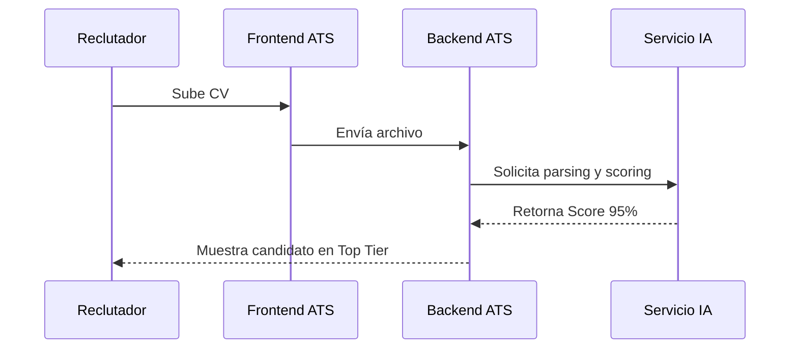
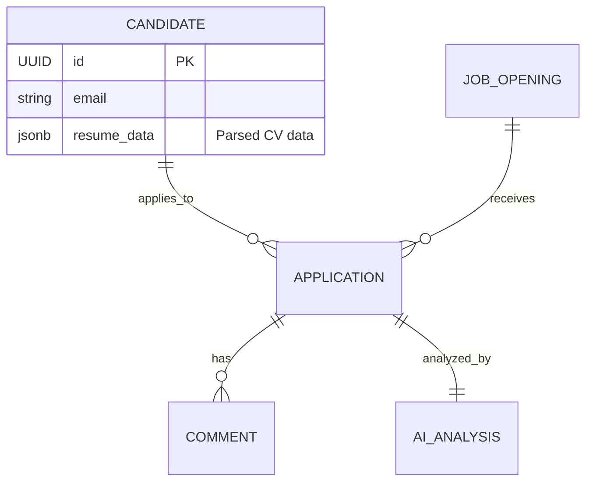
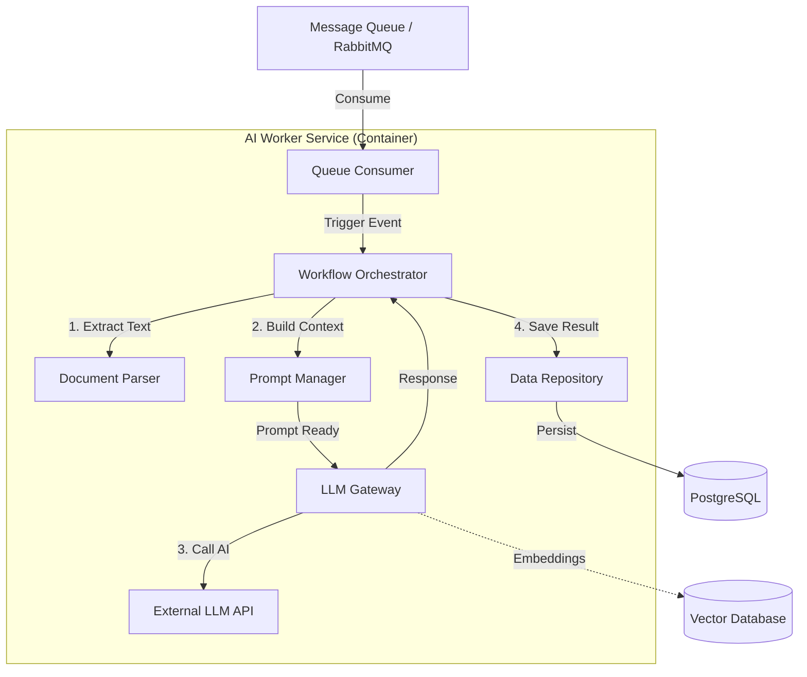

# Prompt 1:

# Rol
Actúa como un Senior Product Owner experto en HR Tech y Analista de Mercado.

# Objetivo
Realizar una investigación profunda sobre el estado del arte de los sistemas ATS (Applicant Tracking Systems) para fundamentar el desarrollo de una nueva solución de software.

# Instrucciones de Investigación
Realiza una búsqueda exhaustiva y preséntame un informe ejecutivo que cubra los siguientes puntos clave:

1. **Pain Points Actuales:** ¿Cuáles son las mayores quejas de los reclutadores y hiring managers con los ATS actuales (ej. Greenhouse, Lever, Workday)? Busca foros, reviews de G2 o Capterra y artículos recientes.
2. **Tendencias de IA en HR:** ¿Qué funcionalidades específicas de Inteligencia Artificial están siendo adoptadas realmente (no solo hype)? (Ej. Screening automático, chatbots, matching de candidatos).
3. **Brechas de Colaboración:** Investiga problemas comunes en la comunicación entre el departamento de HR y los gerentes de línea durante el proceso de selección.
4. **Automatización:** Lista las 5 tareas repetitivas que los competidores aún no resuelven bien y que consumen más tiempo.

# Formato de Salida
- Entrega los resultados en una lista estructurada con viñetas.
- Cita fuentes o ejemplos de competidores cuando sea relevante.
- Concluye con una sección de "Oportunidades de Océano Azul" (áreas poco exploradas donde nuestro nuevo software podría ganar).
---
# Prompt 2:

# Contexto
Eres un Senior Product Owner especializado en sistemas ATS. Estamos documentando un nuevo software diseñado para revolucionar la eficiencia en HR, la colaboración en tiempo real y la asistencia por IA.

# Input
Toma como referencia la investigación de mercado y análisis de brechas que te he proporcionado anteriormente (o que acabamos de generar).

# Tarea
Genera la documentación inicial de definición del producto siguiendo esta estructura estricta:

## 1. Descripción del Software (Elevator Pitch)
Redacta una descripción breve (máximo 2 párrafos) del software. Define claramente qué es, para quién es y qué problema macro resuelve. Enfócate en la propuesta de valor de "colaboración en tiempo real" y "IA asistida".

## 2. Funciones Principales (Core Features)
Desglosa las funcionalidades clave en estas 4 categorías, proporcionando una breve explicación técnica/funcional de cada una:
- **Eficiencia HR:** (Ej. Pipeline visual, parsing de CVs avanzado).
- **Colaboración Real-Time:** (Ej. Chat integrado en el perfil del candidato, menciones @managers).
- **Automatización:** (Ej. Agendamiento de entrevistas, correos de rechazo automáticos con delay humano).
- **Asistencia de IA:** (Ej. Generación de score de compatibilidad, redacción de JDs, análisis de sentimiento en entrevistas).

## 3. Ventajas Competitivas
Lista 3 diferenciadores únicos que harán que este ATS sea superior a las soluciones tradicionales basadas en los "Pain Points" detectados en la investigación.

## 4. Modelo de Negocio: Lean Canvas
Genera un Lean Canvas completo para entender la viabilidad del negocio.
**IMPORTANTE:** Si es posible, entrégame el Lean Canvas en formato de tabla Markdown y también en código Mermaid.js para poder visualizarlo como diagrama.

El Lean Canvas debe incluir:
- Problema
- Solución
- Métricas Clave
- Proposición de Valor Única
- Ventaja Injusta
- Canales
- Segmentos de Clientes
- Estructura de Costos
- Flujos de Ingresos

# Tono y Estilo
Profesional, técnico pero accesible, orientado a negocio y producto.
---

# Prompt 3:

# Rol
Actúa como un Senior Product Owner y Analista Técnico de Sistemas.

# Contexto
Continuamos con la documentación del ATS para HR. Basándote en la definición del producto y el Lean Canvas anteriores, necesitamos detallar la interacción usuario-sistema.

# Tarea
Desarrolla los **3 Casos de Uso Principales (High-Value Use Cases)** que demuestren las funcionalidades clave: IA, Colaboración y Automatización.

Por favor, enfócate en estos tres escenarios específicos:
1.  **Screening Inteligente de Candidatos (IA):** Desde que llega un CV hasta que el sistema lo clasifica y sugiere un match.
2.  **Evaluación Colaborativa en Tiempo Real:** Interacción entre un Reclutador y un Hiring Manager discutiendo un perfil dentro de la plataforma.
3.  **Agendamiento Automatizado de Entrevistas:** El flujo donde el sistema coordina agendas sin intervención manual excesiva.

# Formato de Entrega para cada Caso de Uso
Para cada uno de los 3 casos, debes entregar estrictamente lo siguiente:

### A. Ficha Técnica
* **Nombre del Caso de Uso:**
* **Actores:** (Ej. Reclutador, Hiring Manager, Candidato, Sistema ATS, IA Agent).
* **Precondiciones:** Qué debe haber pasado antes.
* **Flujo Principal (Happy Path):** Lista numerada paso a paso de las acciones.
* **Excepciones / Flujos Alternativos:** (Ej. Qué pasa si la IA no puede leer el CV).
* **Postcondiciones:** El estado final del sistema.

### B. Diagrama de Secuencia (Mermaid)
Genera el código `mermaid` para un **Diagrama de Secuencia** que represente visualmente el flujo principal descrito.
* Asegúrate de separar las "Líneas de vida" (Lifelines) claramente: Usuario, Frontend, Backend ATS, Servicio de IA, Notificaciones.
* Usa notas en el diagrama para resaltar donde ocurre la "magia" (ej. "IA analiza keywords", "Notificación enviada a Slack").

# Ejemplo de estructura esperada para el código Mermaid:

---
# Prompt 3:
# Rol
Actúa como un Arquitecto de Datos Senior y Lead Backend Developer.

# Contexto
Estamos diseñando la arquitectura de datos para el sistema ATS descrito anteriormente. El sistema debe soportar alta concurrencia, colaboración en tiempo real y almacenamiento de metadatos generados por IA.

# Tarea
Diseña el **Modelo de Datos Lógico** para el sistema.
Debes identificar las entidades principales, sus atributos (con tipos de datos) y las relaciones entre ellas.

# Requisitos Específicos del Modelo
El modelo debe ir más allá de un ATS estándar e incluir soporte para las funcionalidades clave del proyecto:
1.  **Core:** Candidatos, Ofertas de Trabajo (Jobs), Solicitudes (Applications).
2.  **Colaboración:** Hilos de comentarios/feedback entre reclutadores y managers asociados a una solicitud específica.
3.  **IA y Datos:** Tablas para almacenar el parsing de CVs y los resultados del análisis de IA (ej. `ai_matching_score`, `sentiment_analysis`, `keywords_extracted`).
4.  **Automatización:** Reglas de workflows (ej. Triggers y Acciones).

# Formato de Entrega

## 1. Diccionario de Datos (Tablas Markdown)
Para cada entidad, crea una tabla con las columnas:
* **Nombre del Atributo** (usar snake_case, ej. `candidate_id`)
* **Tipo de Dato** (ej. UUID, VARCHAR(255), BOOLEAN, JSONB, TIMESTAMP)
* **Descripción/Propósito** (Breve explicación).
* **Restricciones** (PK, FK, Unique, Not Null).

*Nota: Sugiere el uso de tipos de datos flexibles (como JSONB) para almacenar la metadata de la IA, ya que esta estructura puede cambiar.*

## 2. Diagrama Entidad-Relación (Mermaid)
Genera el código `mermaid` usando la sintaxis `erDiagram`.
* Define claramente las relaciones (uno a uno, uno a muchos, muchos a muchos).
* Usa la notación correcta de patas de gallo (`||--o{`, etc.).
* Incluye las entidades: `User`, `Role`, `Candidate`, `JobOpening`, `Application`, `ApplicationComment` (para colaboración), `AIAnalysisLog`, `WorkflowRule`.

# Ejemplo de estructura esperada para Mermaid:

---
# Prompt 4:
# Rol
Actúa como un CTO y Arquitecto de Software Senior con experiencia en sistemas distribuidos y SaaS.

# Contexto
Hemos definido un ATS (Applicant Tracking System) con funcionalidades de IA, colaboración en tiempo real y automatización. Ahora necesitamos el **Diseño de Alto Nivel (HLD)** para guiar al equipo de ingeniería.

# Tarea
Diseña la arquitectura técnica del sistema. El diseño debe ser escalable, seguro y capaz de manejar procesos asíncronos pesados (para la IA) sin bloquear la experiencia del usuario.

# Entregables Requeridos

## 1. Estrategia de Arquitectura
Describe la arquitectura propuesta (ej. Monolito Modular, Microservicios, Serverless). Justifica tu elección basándote en un equilibrio entre velocidad de desarrollo y escalabilidad.
* **Nota importante:** Debes proponer una arquitectura **Event-Driven** (basada en eventos) para manejar las automatizaciones y las tareas de IA en segundo plano.

## 2. Stack Tecnológico Sugerido
Recomienda las tecnologías específicas para cada capa y explica brevemente por qué:
* **Frontend:** (Ej. React/Next.js, Tailwind).
* **Backend:** (Ej. Node.js/Python, FastAPI).
* **Base de Datos:** (Debes incluir SQL para datos transaccionales y Vector Database o Elasticsearch para búsquedas semánticas y matching de candidatos).
* **Infraestructura de IA:** (Ej. LangChain, OpenAI API / HuggingFace, Celery/RabbitMQ para colas de tareas).
* **Real-Time:** (Tecnología para el chat y notificaciones, ej. WebSockets/Socket.io).

## 3. Componentes Principales del Sistema
Describe los bloques principales del sistema:
* **API Gateway / Load Balancer.**
* **Core Service:** Gestión de usuarios, vacantes y aplicaciones.
* **Notification Service:** Manejo de websockets para colaboración en vivo.
* **AI Worker Service:** Microservicio aislado que procesa CVs y ejecuta algoritmos de matching (debe consumir de una cola).
* **Storage:** Dónde se guardan los archivos PDF/Docx.

## 4. Diagrama de Arquitectura (Mermaid C4 Container)
Genera el código `mermaid` para un diagrama de arquitectura (tipo C4 Container o diagrama de flujo de sistema) que visualice cómo interactúan estos componentes.
* Muestra claramente la separación entre el "Cliente" (Navegador), la "API" y los "Workers de IA".
* Representa el flujo asíncrono: El usuario sube un CV -> La API lo guarda -> Se envía un evento a la Cola -> El Worker de IA lo procesa -> Se actualiza la DB -> Se notifica al usuario vía WebSocket.

# Ejemplo de estructura esperada para Mermaid:
```mermaid
graph TD
    User[Cliente Web/Mobile] -->|HTTPS| LB[Load Balancer]
    LB --> API[API Gateway / Backend Core]
    API -->|Guarda Datos| DB[(PostgreSQL)]
    API -->|Guarda Archivos| S3[Object Storage]
    
    %% Flujo Real-time
    User <-->|WebSockets| Socket[Servicio de Notificaciones]
    
    %% Flujo IA Asíncrono
    API -->|Publica Evento| Queue[Message Queue (RabbitMQ)]
    Queue --> AI[AI Worker Service]
    AI -->|Consulta/Embeddings| VectorDB[(Vector DB)]
    AI -->|Actualiza| DB
    AI -->|Notifica fin de tarea| Socket
```
---
# Prompt 5:

# Rol
Actúa como un Arquitecto de Software Especialista en IA y Backend.

# Contexto
Estamos profundizando en el diseño técnico del sistema ATS. Previamente definimos una arquitectura de alto nivel donde existe un contenedor llamado **"AI Worker Service"**.
Este servicio funciona de manera asíncrona, consumiendo mensajes de una cola (Queue) para procesar CVs, generar resúmenes y calcular matchings.

# Tarea
Genera un **Diagrama C4 de Nivel 3 (Diagrama de Componentes)** específico para el contenedor **"AI Worker Service"**.
Debes "hacer zoom" dentro de este microservicio y mostrar sus módulos internos, interfaces y cómo interactúan entre sí y con los elementos externos.

# Componentes Internos Requeridos
El diseño debe incluir al menos los siguientes componentes lógicos dentro del servicio:
1.  **Queue Consumer / Listener:** El punto de entrada que escucha eventos (ej. `CV_UPLOADED`).
2.  **Orchestrator / Workflow Engine:** El controlador que decide el orden de ejecución (primero parsear, luego analizar, luego guardar).
3.  **Document Parser:** Módulo encargado de extraer texto plano de PDFs/Docx (OCR o librerías de texto).
4.  **Prompt Manager:** Componente que construye los prompts dinámicos (inyectando la data del candidato y la JD).
5.  **LLM Gateway / Client:** La interfaz que maneja la conexión con la API de IA (OpenAI/Anthropic), gestionando retries y rate limits.
6.  **Vector Handler:** Componente encargado de generar embeddings y comunicarse con la Vector DB.
7.  **Data Repository:** Capa de acceso a datos para guardar los resultados en la base de datos transaccional (PostgreSQL).

# Entregables

## 1. Explicación de Componentes
Breve descripción (1 línea) de la responsabilidad de cada componente listado arriba.

## 2. Diagrama C4 Component (Código Mermaid)
Genera el código `mermaid` usando `graph TD` (o la sintaxis C4 si es compatible) representando:
* **Límites:** Un subgrafo principal que represente el contenedor "AI Worker Service".
* **Nodos:** Los componentes internos mencionados.
* **Externos:** Muestra fuera del subgrafo los elementos con los que interactúa: `Message Queue`, `External LLM API`, `Vector DB`, `PostgreSQL`.
* **Flujo:** Flechas direccionales con etiquetas que expliquen la acción (ej. `Consumer` -> `Orchestrator`: "Inicia Job").

# Ejemplo de estructura esperada para Mermaid:

---